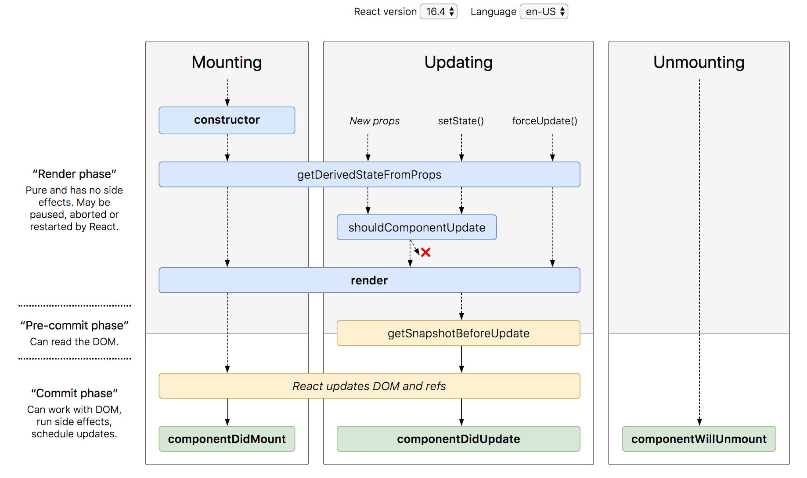

# Lifecycle
## Mounting
#### constructor
Is used to initialize props, any function, variable , objects. Is the function to be called in component rendering.
#### static getDerivedStateFromProps(props, state) replacement of componentWillMount()
is used very rarely when we have to handle the change of props on state of the component
#### render()
returns JSX dom, never use setState here 
#### componentDidMount()
runs after the when the dom is rendered.
you can use it to capture any dom element.

## Updating
#### static getDerivedStateFromProps(props, state)
same as above
#### shouldComponentUpdate()
will tell component to rerender the component or not ? by default returns true.

#### render()
Same as above
#### getSnapshotBeforeUpdate(prevProps, prevState) // rarely used
Contains the previous state and props data wcihc was before the update. Mainly used to handle UI changes in here. 
it's re-rendered, and allows you to return any values you might need to know from the old DOM layout into componentDidUpdate (where you have access to the new DOM layout)

#### componentDidUpdate(prevProps, prevState, snapshot)
 This method is not called for the initial render. is used to work with revious props.

## Unmounting
#### componentWillUnmount()
When leaving the component like when in navigation the dom of component will unmount itself. It is useful to clear all subscriptions.

